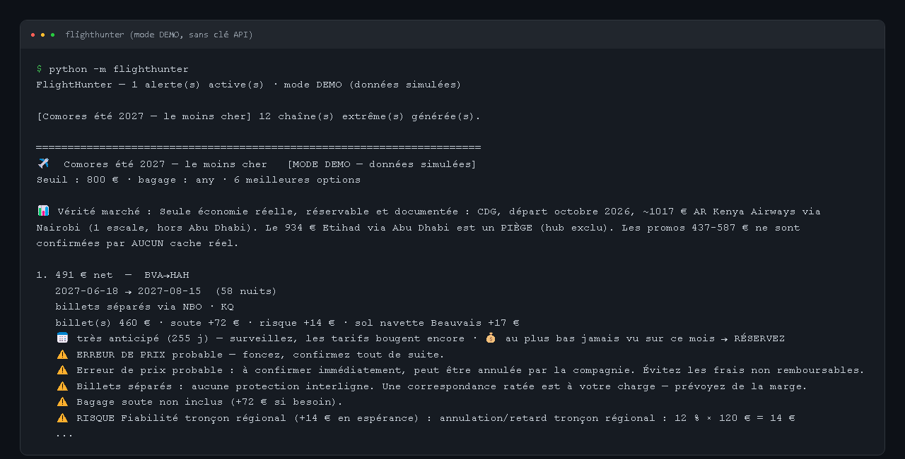

# FlightHunter 🛫

<p align="center"></p>

> **Statut : projet d'apprentissage en pause.** Le code fonctionne en mode démo, sans clé API. Pour l'essayer avec de vraies données, copier `config/secrets.env.example` en `config/secrets.env` et y mettre ses propres clés (ce fichier est ignoré par git).


Chasseur de vols multi-sources — trouve le billet **le moins cher** pour un vol
précis sur une **période** (ex. été), avec alertes multiples, billets séparés,
open-jaw, multimodal (train/bus + aéroports secondaires), détection d'erreurs de
prix, cashback et notifications email/Telegram.

> **Cas d'usage de référence :** France → Moroni (Comores, HAH) pour l'été,
> le plus longtemps possible, sous 800 €.

## Démarrage rapide (mode DEMO, sans aucune clé)

```powershell
pip install -r requirements.txt
python -m flighthunter
```

Le **mode DEMO** génère des prix simulés réalistes pour que vous voyiez tout le
pipeline fonctionner immédiatement. Dès que vous ajoutez une clé (voir plus bas),
l'outil bascule sur les vraies données.

## Configuration

Tout est dans `config/` :

| Fichier | Rôle |
|---|---|
| `alerts.yaml` | Vos alertes : origines, destination, fenêtre de dates, séjour, seuil de prix, **bagage** (configurable), et un **toggle par astuce**. |
| `routes.yaml` | Hubs autorisés/exclus (Abu Dhabi exclu, Tanzanie signalée), buffers de correspondance. |
| `ground.yaml` | Coûts/durées train/bus vers chaque aéroport (coût **porte-à-porte**). |
| `network.yaml` | Réseau du **moteur extrême** : portes d'entrée transfrontalières, segments aériens low-cost, notes de visa. |
| `secrets.env` | Clés API et identifiants (copiez `secrets.env.example`). **Tout est optionnel.** |
| `insights.json` | (optionnel) Insights de marché (baselines par origine, délai de réservation optimal) produits par le workflow d'analyse. |

### 💶 Prix net RISQUE-PONDÉRÉ (Abu Dhabi / Tanzanie accessibles)

Aucun hub n'est exclu en dur : **tout est accessible mais le risque est chiffré**
en espérance (probabilité × coût) et **ajouté au prix net**. Exemples par défaut
(éditables dans `routes.yaml > risk_profiles`) : Tanzanie/Precision Air **+134 €**
(vol retardé/annulé faute de passagers, rebillet si pressé, correspondance ratée),
Abu Dhabi/Etihad **+13 €**, Nairobi/Kenya Airways **+0 €**. Un vol « moins cher »
mais risqué peut ainsi devenir plus cher qu'un vol fiable.

### 📅 Réservation anticipée (book-early)

Chaque option affiche le **délai avant départ** et une **recommandation** :
`✅ fenêtre optimale`, `💰 au plus bas jamais vu → RÉSERVEZ`, ou `⏰ proche du
départ`. L'historique par mois de départ (table `price_obs`) alimente le signal
« au plus bas observé » — plus l'outil tourne, plus il sait quand réserver tôt.

### 🔥 Mode extrême (chaînes multi-legs)

Activé par le toggle `extreme_multileg: true` d'une alerte. Le moteur cherche le
chemin le moins cher du type **domicile →(train transfrontalier)→ porte d'entrée
→(vols low-cost enchaînés)→ hub (Addis/Nairobi/Istanbul) →(attente pour capter le
vol régional le moins cher)→ Moroni**. Chaque itinéraire est chiffré **honnêtement** :
billet de chaque segment, trajets sol, **hébergement des nuits d'attente**, bagage
par segment, + avertissements visa / temps de transit / risque billets séparés.
Paramétrable via le bloc `extreme:` de l'alerte (`max_flight_legs`, `hub_wait`,
`allow_cross_border_ground`, etc.).

### Brancher les vraies sources
Copiez `config/secrets.env.example` en `config/secrets.env` et renseignez ce que
vous avez. La première clé utile et gratuite : **`TRAVELPAYOUTS_TOKEN`**
(inscription affiliée). Pour les alertes : SMTP (email) et/ou un bot Telegram.

## Surveillance automatique (Windows)

```powershell
./scripts/schedule_task.ps1          # lance FlightHunter toutes les 2 h
```

## Architecture (Phase 1 livrée)

```
flighthunter/
├─ sources/     # mock (demo) + travelpayouts (réel) ; duffel/kiwi/scrapfly à venir
├─ engine/      # matrice de dates, routes (hubs/types), bagage, accès sol
├─ pricing/     # prix net porte-à-porte, cashback, détection d'anomalies
├─ storage/     # SQLite : historique prix, dédup alertes, ROI
├─ notify/      # email + Telegram + console
└─ orchestrator.py
```

## Feuille de route
- ✅ **Données réelles Travelpayouts** (token actif), prix net risque-pondéré, réservation anticipée, moteur extrême multi-legs avec prix de segments réels.
- ✅ **Flux error-fare** Fly4Free (keyless, section Deals). *Secret Flying bloque son RSS (403) → nécessitera ScrapFly.io.*
- ✅ **Duffel** — squelette prêt : ajoutez `DUFFEL_TOKEN` dans `secrets.env` pour activer les tarifs live réservables.
- **À venir** — Kiwi (virtual interlining) via Travelpayouts ; IA (Claude) pour parser/résumer les deals ; cashback réel + dashboard ROI ; ScrapFly.io (anti-bot, débloque Secret Flying et le scraping OTA) **si le ROI est prouvé**.

## Avertissements
- **Billets séparés** : pas de protection interligne — une correspondance ratée est à votre charge.
- **Erreurs de prix** : parfois annulées par la compagnie ; ne jamais engager de frais non remboursables sans confirmation.
- **Scraping / hidden-city / arbitrage POS** : zone grise des CGV ; usage strictement personnel.
